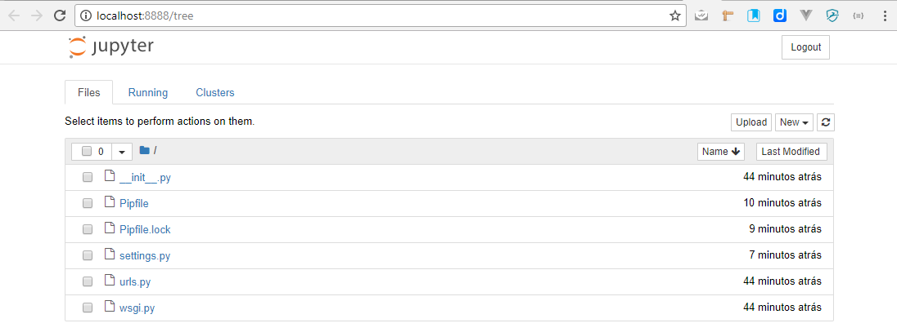

# 06. Rodando o shell_plus para executar comandos python

## Ativando o Django Extensions

Para ativar o `shell_plus`, basta jogar em *`INSTALLED_APPS`* no arquivo **settings.py** o `'django_extensions'`

    #!python
        INSTALLED_APPS = [
        'django.contrib.admin',
        'django.contrib.auth',
        'django.contrib.contenttypes',
        'django.contrib.sessions',
        'django.contrib.messages',
        'django.contrib.staticfiles',
        'django_extensions'
    ]

## Executando via console:

    #!dos
    manage shell_plus

## Executando via navegador (browser):

    #!dos
    manage shell_plus --notebook
    Obs: aqui deverá abrir uma url com o token, algo semelhante a:
    http://localhost:8888/?token=a9dfb42cc3673202a35e16869dcc26c32d6fa720e31b6c21

Clique em `New` e depois em Django Shell-Plus

Para usar é super simples:
  <kbd>enter</kbd> : Pula linha
  <kbd>shift-enter</kbd> : Executa o comando

## Observações

!!! question "Para que serve o Shell_Plus?"

    "Mais para frente você entenderá melhor a necessidade do uso dele. Facilita demais testarmos a aplicação.

!!! info "Shell_Plus"

    "Para sair do shell_plus via console, é só digitar: `exit()` e pressionar <kbd>enter</kbd> e para sair do shell_plus via browser, quero dizer, parar o serviço, basta ir no console que estiver executando e pressionar: <kbd>ctrl+c</kbd>
