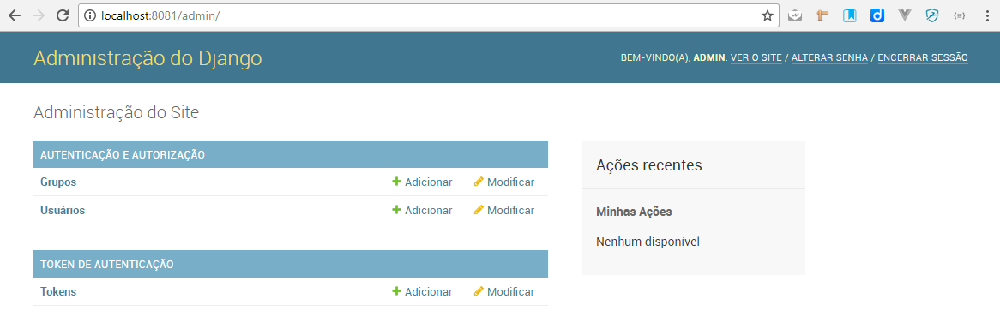

# 12. Preparando a autenticação via TOKEN

## Criando a tabela Token

Agora, vamos ativar a autenticação via TOKEN. Para isso, basta digitar na linha de comando:

    #!dos
    manage migrate

Você deverá ver algo como:

    #!dos hl_lines="4 5"
    Operations to perform:
      Apply all migrations: admin, auth, authtoken, contenttypes, sessions
    Running migrations:
      Applying authtoken.0001_initial... OK
      Applying authtoken.0002_auto_20160226_1747... OK

## Verificando a criação

Agora se rodar o server novamente:

    #!dos
    manage runserver localhost:8081

Você verá que o token apareceu no admin do django:

