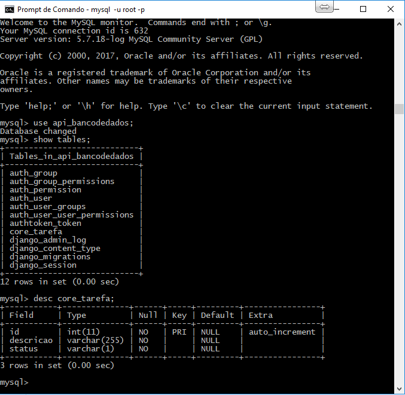
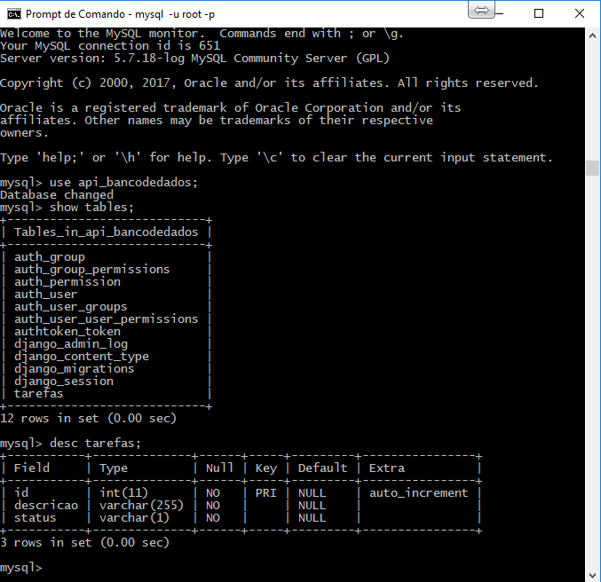

14. Trabalhando com os Migrations

## Fazendo a Mágica acontecer

Agora é a hora da mágica (rs), basta executar o comando:

``` dos
manage makemigrations
```

E o django irá criar a migration da tabela **`tarefa`** chamada de **`0001_initial.py`**.

Agora vamos executar o comando abaixo para criar em sí a tabela no banco de dados:

``` dos
manage migrate
```

## Convenção de Prefixo

Por convensão, o django irá criar a tabela no banco chamada de: **`core_tarefa`**, ou seja, ele irá gerar um prefixo: "core_" que é o nome da nossa App criada.

Você pode comprovar conforme imagem abaixo obtida entrando no mysql:

``` dos
mysql -u root -p
```

[](../assets/images/bancodedados.PNG)

## Forçar o nome da tabela no model

* Forçando o nome da tabela a ser criado sem o prefixo.

  Abra o arquivo **`core > models.py`** e adicione o seguinte código dentro do class Meta:

  ``` python
  db_table = 'tarefas'
  ```

Ficará assim:

  ``` python hl_lines="21"
  from django.db import models

  # Create your models here.

  class Tarefa(models.Model):

      STATUS = (
          ('P', 'Pendente'),
          ('F', 'Finalizada'),
          ('C', 'Cancelada')
      )

      descricao = models.CharField(max_length=255)
      status = models.CharField(max_length=1, choices=STATUS, default='P')

      def __str__(self):
          return self.descricao

      class Meta:
          ordering = ('id', 'descricao')
          db_table = 'tarefas'
  ```

## Revisando as Migrations

Imagine que agora iremos precisar recriar a migration novamente e desfazer a que criamos.

Para visualizar as migrations já criadas/executadas, digite o comando:

``` dos
manage showmigrations core
```

Você terá algo como:

``` dos
[X] 0001_initial
```

## Revertendo as Migrations do Zero

Como estamos no início da aplicação, podemos reverter todas as migrations com o comando:

``` dos
manage migrate core zero
```

Se executarmos novamente o comando para ver as migrations executadas, teremos:

``` dos
manage showmigrations core
```

Deverá ter algo como:

``` dos
 [ ] 0001_initial
```

## Recriando as Migrations

Agora, podemos remover o arquivo **`core > migrations > 0001_initial.py`** e recriá-lo com o comando:

``` dos
manage makemigrations
```

Você vai notar se editar o arquivo que ele criou em options a instrução abaixo:

``` python
'db_table': 'tarefas',
```

Se tudo correu bem e você entrar no banco de dados (mysql), você deverá ter a sua tabela anterior: `core_tabelas` excluída e a nova tabela: `tarefas` gerada com sucesso conforme a imagem abaixo:


[](../assets/images/bancodedados_novo.PNG)

## Dica: Fixando o comando

!!! info "Migration"

    manage migrate core zero
