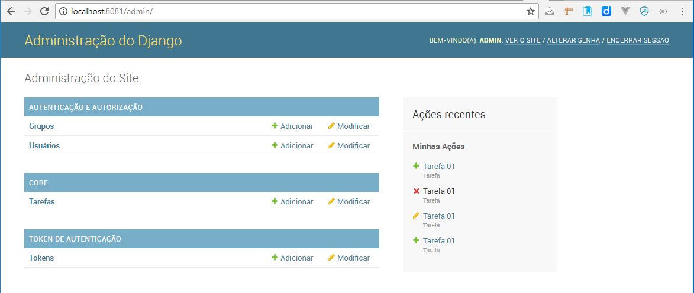
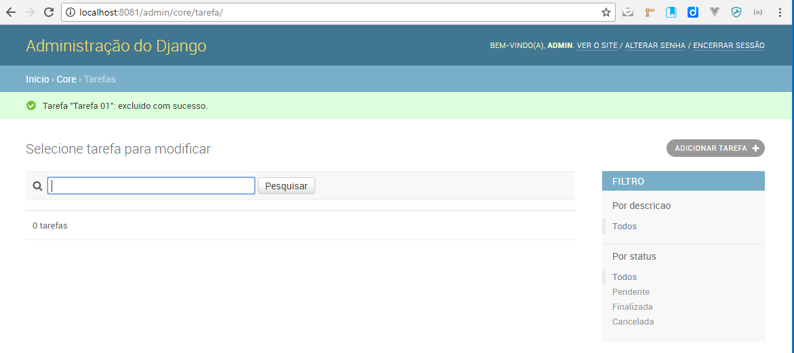
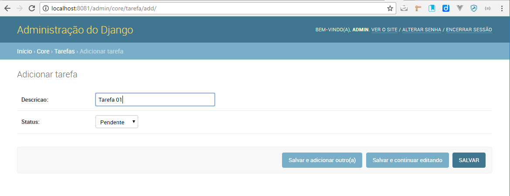
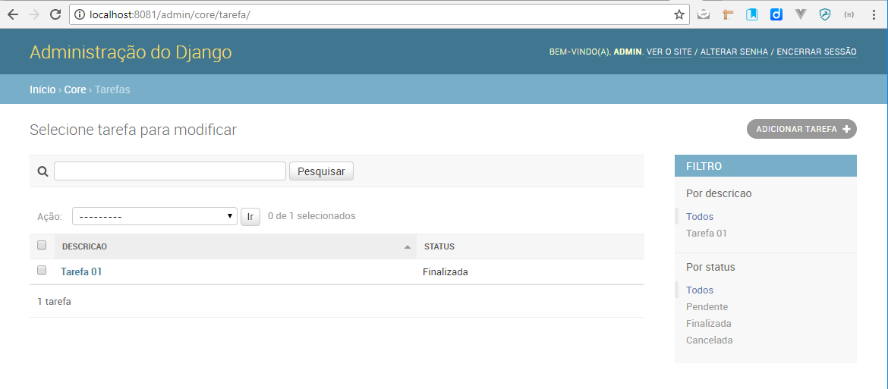
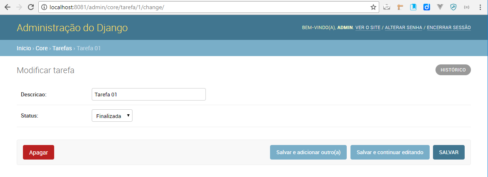
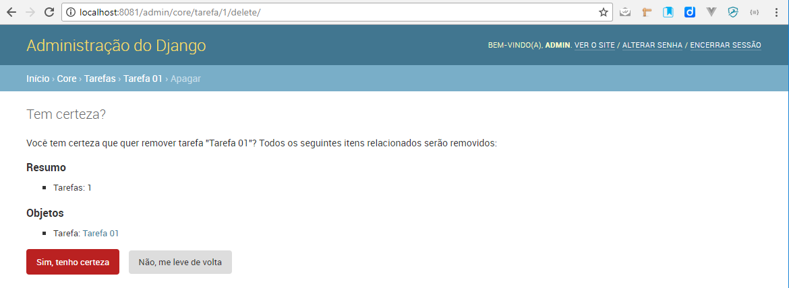

# 15. Testando nosso primeiro CRUD

## Testar a aplicação

  ``` dos
  manage runserver 127.0.0.1:8081
  ```

* Abrir o admin no navegador: `http://localhost:8081/admin/`

  Você deverá ter algo do tipo:

  [](../assets/images/tarefa_menu.PNG)
**Admin do Django com o módulo de Tarefas dentro do Core**

## Crud Completo

* Abrir o admin no navegador: `http://localhost:8081/admin/core/tarefa/` ou clicar simplesmente em Tarefas no módulo do Admin acima:

  [](../assets/images/tarefa_crud.PNG)
  <center>**CRUD : Com todas as funcionalidades**</center>

  [](../assets/images/tarefa_crud_insert.PNG)
  <center>**CRUD : Incluir**</center>

  [](../assets/images/tarefa_crud_inserted.PNG)
  <center>**CRUD : Pesquisar**</center>

  [](../assets/images/tarefa_crud_edit.PNG)
  <center>**CRUD : Editar (clicar na descrição)**</center>

  [](../assets/images/tarefa_crud_delete.PNG)
  <center>**CRUD : Excluir**</center>

  Você vai notar que o DJANGO fez o CRUD completo pra nós.

É importante ressaltar que esse **CRUD** possui o recurso de **pesquisa** (search), de **filtro** e de **insert**, **edit** e **delete** e isso se deu por conta da implementação feita no arquivo **`core > admin.py`** abaixo:

    #!python hl_lines="3 4 5"
    @admin.register(Tarefa)
    class TarefaAdmin(admin.ModelAdmin):
        list_display = ['id', 'descricao', 'status']
        list_filter = ('descricao', 'status')
        search_fields = ('descricao',)

